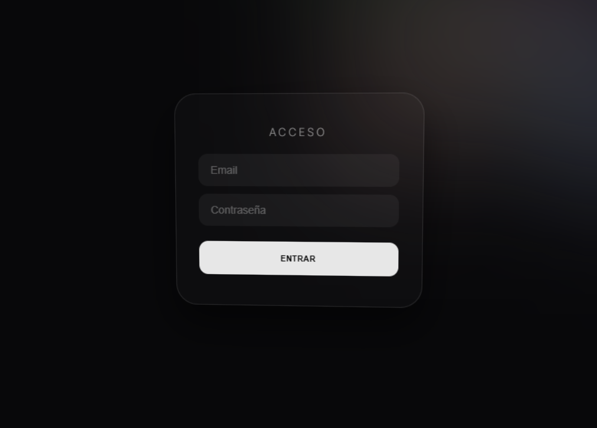

# 3D Soft Minimal Login - WebGL Experience

Este proyecto es una interfaz de inicio de sesión de alta gama que utiliza **Three.js** para renderizar un entorno 3D interactivo. Combina el efecto **Glassmorphism** en la UI con un fondo dinámico de esferas procedimentales (estilo lava lamp) y renderizado **CSS3D**.

## ✨ Características Principales

* **Fondo WebGL Dinámico:** Esferas 3D con movimiento suave y cambios de color pastel (HSL) en tiempo real.
* **Interactividad 3D:** El formulario reacciona al movimiento del mouse, rotando levemente en el espacio tridimensional.
* **CSS3DRenderer:** El formulario no es un simple elemento HTML plano, está integrado dentro del motor de renderizado 3D de Three.js.
* **Efecto Soft Blur:** Filtros de desenfoque (`blur`) aplicados tanto al fondo como a la tarjeta para una estética ultra-minimalista.
* **Feedback de Usuario:** Botón de "Entrar" con estado de carga (spinner) animado mediante JavaScript.

## 🛠️ Tecnologías Utilizadas

* **Three.js (v0.160.0):** Motor principal para la escena 3D.
* **CSS3DRenderer Add-on:** Para proyectar elementos HTML en un entorno 3D.
* **WebGL:** Para el renderizado eficiente de las geometrías (Icosaedros).
* **HTML5 & CSS3:** Estructura y diseño de la tarjeta de login con soporte para filtros de fondo.

## 📦 Estructura del Código

El archivo principal contiene tres secciones clave:

1.  **Estilos (CSS):** Define el aspecto "Glass" de la tarjeta y las animaciones del spinner.
2.  **Escena 3D (JavaScript/Three.js):** * `init()`: Configura la cámara, luces y el motor WebGL.
    * `animate()`: Maneja la lógica de movimiento de las "blobs" y la rotación de la tarjeta según el mouse.
3.  **Lógica de UI:** Función `iniciarSesion()` que simula una petición al servidor activando un estado de carga por 2.5 segundos.

## 🚀 Cómo Ejecutarlo

Al utilizar **ES Modules** e importar Three.js desde una CDN, se recomienda:

1.  Descargar el archivo `.html`.
2.  Ejecutarlo a través de un servidor local (por ejemplo, usando la extensión *Live Server* de VS Code o `python -m http.server`).
    * *Nota: Algunos navegadores bloquean funciones de módulos si se abren directamente como archivo local (`file://`).*

## 🎨 Personalización

Puedes ajustar los siguientes parámetros en el código:

* **Sensibilidad del mouse:** Modifica los valores en `loginObject.rotation` dentro de la función `animate`.
* **Cantidad de esferas:** Cambia el límite del bucle `for` en la función `init` (actualmente en 6).
* **Colores:** Ajusta la saturación y luminosidad en `b.material.color.setHSL`.

---
Proyecto desarrollado para interfaces de usuario experimentales y modernas.
